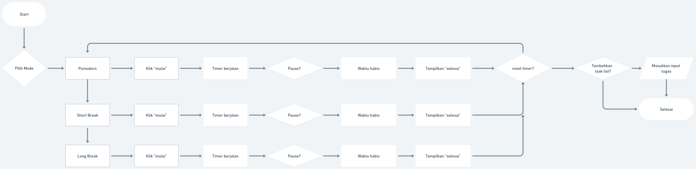

# Pomodoro Timer

- Laudya Aprilia Khoirum                    (10241038) (100%)
- Clara Uenike Meylan Langi                 (10241018) (100%)
- Moh Irsyad Fiqi Ferdiansyah Difa Nanda    (10241042) (100%)
- Raihandy Wijaya                           (10241064) (100%)


## Pendahuluan
Di era digital saat ini manajemen waktu menjadi keterampilan yang sangat penting untuk menunjang produktivitas terutama bagi pelajar, mahasiswa, dan pekerja profesional. Berbagai penelitian menunjukkan bahwa teknik Pomodoro dapat membantu meningkatkan manajemen waktu dan mengurangi prokrastinasi terutama saat menghadapi tugas-tugas besar yang menantang. Dengan memecah pekerjaan menjadi bagian-bagian kecil dan diselingi istirahat seseorang dapat lebih fokus dan memiliki rasa pencapaian yang lebih cepat terhadap progres kerja mereka. Oleh karena itu, penerapan teknik ini dalam bentuk aplikasi digital seperti Pomodoro Timer sangat relevan untuk mendukung produktivitas di era modern.

Dengan latar belakang tersebut kami mengembangkan sebuah aplikasi Pomodoro Timer berbasis web menggunakan HTML, CSS, dan JavaScript. Tujuan kami membuat pomodoro timer ini adalah membuat alat bantu produktivitas yang mudah digunakan, menarik secara visual dan dapat digunakan secara offline tanpa perlu koneksi internet.

Selain itu, proyek pembuatan aplikasi Pomodoro Timer ini bertujuan sebagai solusi praktis untuk membantu pengguna mengelola waktu secara mandiri dalam berbagai aktivitas, seperti belajar, bekerja, atau menyelesaikan proyek pribadi. Aplikasi ini dirancang agar pengguna dapat fokus pada satu tugas dalam durasi tertentu tanpa gangguan, dengan jeda istirahat yang terjadwal secara otomatis. Fungsi utama dari Pomodoro Timer ini adalah sebagai pengatur siklus kerja dan istirahat, sehingga dapat meningkatkan konsentrasi, mengurangi kelelahan mental, dan membantu pengguna membentuk kebiasaan kerja yang lebih terstruktur. Dengan pendekatan ini, diharapkan pengguna bisa lebih produktif dan efisien dalam menjalani rutinitas harian, terutama di tengah distraksi yang tinggi di era digital.

## Tinjauan Pustaka
Aplikasi Pomodoro Timer sudah banyak dikembangkan oleh berbagai pihak, baik dalam bentuk aplikasi desktop, mobile, maupun berbasis web. Untuk mengembangkan program pomodoro ini kami mengambil referensi dari beberapa web berikut :

- **TomatoTimers** merupakan  merupakan situs web yang menyediakan aplikasi Pomodoro Timer sederhana dan fungsional yang dapat digunakan langsung melalui browser tanpa perlu instalasi. Website ini dirancang dengan antarmuka yang minimalis dan intuitif, memungkinkan pengguna untuk memilih tiga mode utama, yaitu Pomodoro, Short Break, dan Long Break. TomatoTimers sangat membantu dalam mendukung metode manajemen waktu berbasis teknik Pomodoro, karena memungkinkan pengguna fokus bekerja dalam durasi tertentu diselingi waktu istirahat yang terstruktur. Dapat diakses melalui link : https://www.tomatotimers.com/ 
- **Flocus** merupakan situs web produktivitas berbasis personal dashboard yang dirancang untuk membantu pengguna memulai hari dengan lebih fokus dan terorganisir. Flocus menampilkan halaman pembuka yang dapat dikustomisasi dengan to-do list, kutipan motivasi, widget cuaca, serta background gambar yang menenangkan. Tujuan utama dari Flocus adalah menciptakan suasana kerja yang positif dan memotivasi pengguna sejak awal mereka membuka browser, sehingga membantu mengurangi distraksi dan meningkatkan kesadaran terhadap prioritas harian. Dapat diakses melalui link : https://flocus.com/
- **StudyWithMe** merupakan aplikasi web berbasis Pomodoro yang dirancang dengan antarmuka aesthetic guna meningkatkan fokus dan produktivitas. Pengguna dapat memilih dari berbagai tema visual seperti “Cozy Fireplace”, “Tokyo Sakura”, dan “Seoul Sunrise” untuk menciptakan atmosfer belajar yang menyenangkan dan personal. Secara keseluruhan, StudyWithMe.io menggabungkan estetika visual dan audio yang menyenangkan dengan teknik manajemen waktu Pomodoro, menyediakan ruang digital yang dapat disesuaikan untuk belajar atau bekerja dengan lebih fokus dan bersemangat. Dapat diakses melalui link : https://studywithme.io/


## Metode Pembuatan
Dalam proses pengembangan web Pomodoro ini langkah pertama yang kami lakukan adalah menetapkan fitur-fitur yang akan disediakan dalam program. Fitur-fitur tersebut meliputi task list yang berfungsi sebagai wadah untuk menambahkan daftar tugas, serta menu Pomodoro, Short Break, dan Long Break. Selain itu web kami ini juga dilengkapi dengan fitur timer yang dapat dijalankan dan dapat direset. Dalam program ini kami menggunakan :
- Callback functions
```js
setInterval(callback, 1000): 
clearInterval(timerInterval):
```
dimana pada kode `setInterval(callback, 1000)` baris tersebut berfungsi untuk menjalankan fungsi callback untuk setiap 1000 milisecond dimana program akan menjalankan hitungan mundur timer,selanjutnya pada kode `clearInterval(timerInterval)` baris tersebut berfungsi untuk menghentikan timer yang sedang berjalan.
- String and Math Utilities
```js
Math.floor(timeLeft / 60)
String(...).padStart(2, '0')
```
pada baris kode `Math.floor(timeLeft / 60)` baris tersebut memiliki fungsi untuk mengubah detik menjadi menit,sedangkan pada baris kode `String(...).padStart(2, '0')` berfungsi untuk menambahkan 1 digit angka 0 didepan jika angka yang muncul < 10 agar timer tetap dapat menampilkan 2 angka didepan ":"


## Hasil Program
Hasil dari program yang kami buat memiliki beberapa fitur yang diimplementasikan melalui `timer dinamis` berupa menu _pomodoro, short break, dan long break_ dimana dalam ketiga fitur ini menampilkan timer secara real time dengan format menit:detik dan disediakan fitur reset untuk mengembalikan waktu ke mode awal program. Selain itu program ini juga memiliki metode `checkmarks` yang berfungsi untuk menambahkan ✔ secara otomatis untuk tiap sesi pomodoro yang selesai dijalankan. Sedangkan `task list` dalam program ini berfungsi sebagai tempat bagi pengguna untuk menambahkan daftar tugas yang ingin mereka kerjakan, list tugas yang telah ditambahkan dapat diberi tanda ✔ jika telah selesai dikerjakan dan juga dapat dihapus dengan menekan tombol ❌ jika diinginkan. Diagram alir(flowchart) untuk program ini adalah sebagai berikut :
 

Tutorial penggunaan program dapat dilihat melalui video berikut :

<video width="700" height="400" controls autoplay muted>
  <source src="Tutorial.mp4" type="video/mp4">
</video>

## Kesimpulan
#### Pembuatan aplikasi pomodoro timer ini membeikan kami beberapa pengalaman sebagai berikut :
- Membagi jobdesk anggota tim
- Mengimplementasikan logika waktu dengan JavaScript
- Mengidentifikasi fitur-fitur yang cocok untuk digunakan dalam program
#### Kekurangan yang masih dialami dalam program ini diantaranya :
- Belum terdapat notifikasi bila waktu habis
- Belum terdapat history sesi penggunaan program
- Belum terdapat menu yang berisi deskripsi terkait program
- Belum terdapat menu untuk menambahkan/mengubah tema
- Belum terdapat fitur custom timer dan belum dapat menyimpan progress task list
#### Kelebihan dari program yang telah kami buat diantaranya :
- Dapat digunakan secara offline
- Mendukung mode kerja berulang (loop otomatis)
- Desain antarmuka yang sederhana namun fungsional
#### Rencana kami jika program dilanjutkan adalah :
- Menambahkan notifikasi jika waktu habis
- Menambahkan fitur history hasil kerja
- Menambahkan menu deskripsi terkait program
- Menambahkan menu untuk mengubah/menambahkan tema serta nada dering

## Daftar pustaka
- <div id="div_ref1"> 
  https://www.tomatotimers.com/. Diakses pada 23 mei 2025.
  </div>
- <div id="div_ref1"> 
    https://en.wikipedia.org/wiki/Pomodoro_Technique. Diakses pada 7 Juni 2025.
  </div>
- <div id="div_ref2">
  https://flocus.com/. Diakses pada 7 Juni 2025.
  </div>
- <div id="div_ref2">
  https://studywithme.io/. Diakses pada 9 Juni 2025.
  </div>